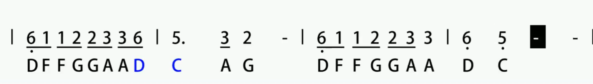
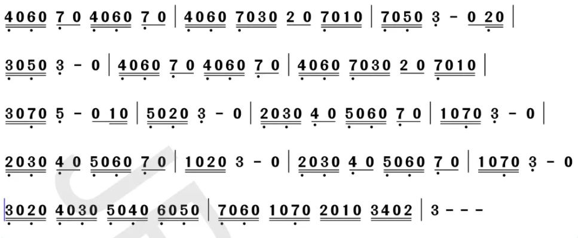

低音1
低音1#
低音2
低音2#
低音3
低音4
低音4#
低音5
低音5#
低音6
低音6#
低音7

中音1
中音1#
中音2
中音2#
中音3
中音4
中音4#
中音5
中音5#
中音6
中音6#
中音7

高音1
高音1#
高音2
高音2#
高音3
高音4
高音4#
高音5
高音5#
高音6
高音6#
高音7

大鱼海棠

塞尔达——萨莉亚

塞尔达这个乐谱会一直重复播放、循环播放、一直播放.....停不下来,不知道怎么回事