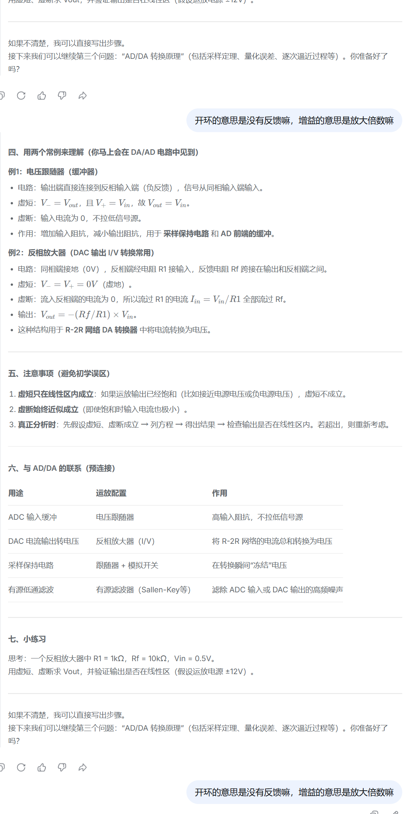
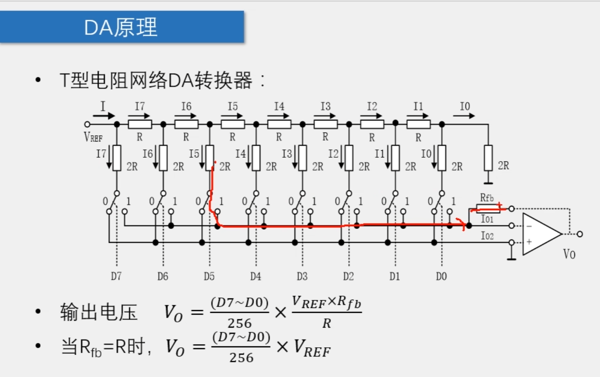

## 第一部分：AD/DA 硬件电路
好的，我们先从 **AD/DA 硬件电路** 的基本概念和常见结构开始讲。

---

## 一、AD 转换器的硬件电路（模拟 → 数字）

AD 的作用是把连续的电压（如 0~5V）转换成数字量（如 0~255 对应 8 位）。硬件上常用的电路类型有：

### 1. **逐次逼近型（SAR-ADC）** —— 最主流，性价比高
硬件组成：
- **模拟输入缓冲**（运放电压跟随器）
- **采样保持电路**（电容 + 模拟开关）：在转换瞬间“冻结”电压
- **比较器**：比较输入电压与 DAC 产生的内部电压
- **内部 DAC**：通常是电容阵列或电阻阵列
- **逐次逼近寄存器（SAR）**：控制逻辑，逐位比较
- **数字输出锁存器**

**工作过程**（以 8 位为例）：
> 从最高位开始，SAR 假设该位为 1，内部 DAC 输出对应电压，与输入电压比较。若输入更高则保留该位为 1，否则置 0。然后下一位… 共比较 8 次。  
> 优点：速度较快（几十~几百 kHz），功耗适中。  
> 典型芯片：ADC0804、ADC0809，也包括 XPT2046（触摸屏控制器内部集成的 ADC）。

### 2. **双积分型** —— 精度高，抗干扰强，但速度慢
硬件组成：
- 积分器（运放 + 电容）
- 比较器
- 计数器
- 基准电压源

**工作过程**：
> 先对输入电压积分固定时间 T1，然后切换至基准电压反向积分，直到输出归零。反向积分时间与输入电压成正比，用计数器测量该时间即得数字值。  
> 典型芯片：ICL7106、ICL7109（常用于数字万用表）。

### 3. **并行比较型（Flash ADC）** —— 极快，但功耗大、位数低
硬件组成：
- 2^n - 1 个比较器（n 位 ADC）
- 电阻分压链
- 编码器

**工作过程**：
> 输入电压同时与所有比较器基准比较，得到“温度计码”，编码后输出。  
> 速度最快（ns 级），但 8 位就需要 255 个比较器，成本高。  
> 典型芯片：TLC5510。

### 4. **Σ-Δ 型** —— 高分辨率（16~24 位），低速
硬件组成：
- 差分积分器
- 比较器（1 位 ADC）
- 数字滤波器

**工作过程**：
> 对输入信号进行过采样（极高速），输出 1 位数据流，再经过数字滤波和抽取得到高分辨率结果。  
> 常用于音频、传感器测量。  
> 典型芯片：ADS1115（16 位，I2C 接口）。

---

## 二、DA 转换器的硬件电路（数字 → 模拟）

DA 的作用是把数字量（如 0~255）转换成对应的模拟电压（如 0~5V）。

### 1. **R-2R 梯形电阻网络（最常用）**
硬件组成：
- 标准 R 和 2R 电阻组成的梯形网络（每个数字位对应一个电阻支路）
- 运放（做电流 → 电压转换）
- 模拟开关（由数字位控制，将电流引向运放虚地或地）

**原理**：
> 每个数字位控制一个开关，该位为 1 时对应的电流流入运放输入端，运放输出电压 = -I × Rf。各支路电流按二进制权重叠加。  
> 优点：电阻值只有两种，适合集成电路。  
> 典型芯片：DAC0832（8 位，与 51 单片机接口简便）。

### 2. **权电阻网络 DA**（早期或分立电路）
硬件组成：
- 一组电阻：R, 2R, 4R, … 2^(n-1)R
- 运放 + 模拟开关

缺点：电阻值范围太宽（如 1MΩ 与 1Ω），精度难以保证，不适合集成。

### 3. **PWM 型 DA** —— 用单片机定时器实现
硬件组成：
- 单片机 PWM 输出引脚
- 一阶或二阶 RC 低通滤波器（电阻 + 电容）
- 可选：运放缓冲

**原理**：
> 改变 PWM 波的占空比，经过 RC 滤波后得到平均电压：  
> Vout = Vref × (高电平时间 / 周期)。  
> 优点：不需要专门 DA 芯片，成本极低，但输出有纹波且速度慢。

### 4. **串行输入 DA**（如 XPT2046 内部是 ADC，不是 DA；DA 常用 MCP4921、TLV5618）
硬件组成：
- 移位寄存器
- 电阻串或 R-2R 网络
- SPI/I2C 接口

---

## 三、与 51 单片机的连接方式（硬件接口）

| 类型 | 典型芯片 | 连接引脚 | 说明 |
|------|----------|----------|------|
| 并行 ADC | ADC0804 | D0~D7, RD, WR, INTR | 占用 8+3 个 IO，速度较快 |
| 并行 DAC | DAC0832 | D0~D7, WR, CS, ILE | 需配合运放输出 |
| 串行 ADC | XPT2046 | CS, DIN, DOUT, DCLK (SPI) | 仅需 4 个 IO |
| 串行 DAC | MCP4921 | CS, SCK, SDI (SPI) | 占用 3 个 IO |
| PWM-DA | 任意 51 | 一个 PWM 引脚 + RC 滤波 | 最简单，但速度慢 |

---

## 四、实际硬件电路注意事项

1. **参考电压**：AD/DA 的精度依赖于 Vref，需使用稳定的基准源（如 TL431）。
2. **模拟地与数字地分离**：单点共地，避免数字噪声串入模拟部分。
3. **运放缓冲**：在 ADC 输入端常加电压跟随器（输入阻抗高，不影响信号源）。
4. **输出滤波**：DA 输出后常加低通滤波器（尤其 PWM 型）。
5. **输入保护**：ADC 输入端可加钳位二极管（1N4148 对 VCC/GND），防止过压。

---

## 五、一张图总结 AD/DA 硬件位置

```
模拟信号（电压/电流）
        │
        ▼
   输入保护/滤波
        │
        ▼
   采样保持电路（ADC内部）
        │
        ▼
   ADC核心（逐次逼近/双积分/Σ-Δ）
        │
        ▼
   数字输出（并行/串行） ──→ 单片机

单片机
        │
        ▼
   数字输入（并行/串行）
        │
        ▼
   DAC核心（R-2R/权电阻/串行DAC）
        │
        ▼
   运放电流转电压（若需要）
        │
        ▼
   低通滤波
        │
        ▼
   模拟电压输出
```

---

现在你已经了解了 AD/DA 硬件电路的基本骨架。  
接下来可以按照你的脉络，进入第二个问题：**运放电路的原理（虚短、虚断）**。请确认是否继续。

我们用一个直白的比喻来理解逐次逼近型 ADC。

核心思想：猜数字游戏（天平称重）
想象一个场景：你有一个 0~255g 的未知重物，你有一组标准砝码：128g、64g、32g、16g、8g、4g、2g、1g。
如何最快称出重量？

先放 128g 砝码，看天平是否倾斜。如果重物更重就保留这个砝码，否则拿走。
然后放 64g，同样判断保留还是拿走。
依次试 32、16、8、4、2、1g。
最后所有保留的砝码总和就是重物的重量。

这个“从大到小逐个尝试”的过程就是逐次逼近。

换成 ADC 的语言
内部结构
一个比较器（代替天平）：比较输入电压与内部 DAC 产生的电压，输出“大”或“小”。

一个内部 DAC：接收数字量，产生对应的模拟电压。

一个逐次逼近寄存器（SAR）：负责控制尝试顺序，并保存最终结果。

你提到的 `1100 0000` 是一个 **8 位二进制数**，对应十进制 **192**。  
在 **8 位逐次逼近型 ADC** 中，通常的转换关系是：

\[
\text{电压} = \frac{\text{数字量}}{256} \times V_{\text{ref}}
\]

假设参考电压 \( V_{\text{ref}} = 5\text{V} \)，则：

\[
\frac{192}{256} \times 5\text{V} = 0.75 \times 5\text{V} = 3.75\text{V}
\]

所以 `1100 0000` 表示 **3.75V** 是这么算出来的。

---

### 更直白的解释（8 位 ADC）

- 8 位 ADC 的输出范围：0 ~ 255（二进制 0000 0000 ~ 1111 1111）
- 0 对应 0V，255 对应 5V（满量程）
- 每个数字步长 = \( \frac{5\text{V}}{256} \approx 0.01953\text{V} \)
- 192 步的电压 = \( 192 \times 0.01953\text{V} \approx 3.75\text{V} \)

---

### 扩展理解（与逐次逼近型 ADC 的原理无关）

这个问题本身只涉及 **数字量到电压的映射**，不涉及 SAR 的工作过程。  
但既然你已经进入第二个问题（运放），我把这个数字换算提前解释清楚，避免卡在这里。  

如果你还想了解 **SAR-ADC 内部到底是怎么逐次比较的**，我可以再用一个“天平称重”的比喻给你讲明白。需要吗？


工作步骤（以 8 位 ADC 为例，输入 0~5V）
最高位尝试：SAR 假设最高位为 1（即数字 1000 0000，对应 2.5V），让 DAC 输出 2.5V。比较器比较输入电压与 2.5V。

如果输入 > 2.5V，则保留该位为 1。

否则置 0。

次高位尝试：假设输入 > 2.5V，SAR 接着尝试次高位：数字 1100 0000（3.75V），DAC 输出 3.75V。

如果输入 > 3.75V → 保留该位为 1。

否则置 0。

依次尝试所有位，直到最低位。

最终 SAR 中的 8 位数字就是转换结果。

为什么叫“逐次逼近”？
每一次尝试都在缩小输入电压所在的区间，像逐步逼近目标：

第一次：确定输入在 0~2.5V 还是 2.5~5V。

第二次：在选定半区内再二分。

……

8 次后，区间宽度 = 5V / 256 ≈ 19.5mV，这就是分辨率。

与 51 单片机的关系
常见 8 位 ADC 芯片（如 ADC0804）就是 SAR 型。连接方式：

8 位数据线接单片机 P0/P1/P2

控制引脚：WR 启动转换，INTR 完成通知

转换时间约 100μs（比 PWM-DA 快得多，比并行比较型慢）

一句话总结
SAR-ADC 像用天平从大到小试砝码，每个时钟周期确定一位，n 位就需要 n 个周期，最终得到数字结果。




你算的 **Vout = -5V** 是正确的。

---

### 判断是否在线性区的方法

运放的线性区是指输出能随输入线性变化的区域，需要满足两个条件：

1. **输出电压未超过电源电压范围**  
   运放由 ±12V 供电，输出理论上不能低于 -12V 或高于 +12V（实际可能略低一两伏，但大致范围是 ±12V）。  
   你算出的 -5V 在 -12V ~ +12V 之间，因此**未饱和**，满足线性条件。

2. **负反馈正常工作，使虚短成立**  
   该电路是标准的反相负反馈结构，只要输出没饱和，虚短（V- = V+ = 0V）就成立，放大器工作在线性区。  
   如果输出达到 -12V 或 +12V 饱和，虚短不再成立，就进入非线性区。

---

### 验证

- 由于 -5V 远离 ±12V 的边界，运放显然工作在线性区。
- 若题目改成 Vin = 2V，则 Vout = -20V，低于 -12V（假设电源 ±12V），此时输出会饱和在 -12V 左右，不再线性。
很好，那我们正式开始讲解运放的 **虚短** 和 **虚断**。

这两个概念是分析 **负反馈** 运放电路的灵魂，也是理解大部分 AD/DA 中信号调理电路（如电压跟随器、反相/同相放大器、I/V 转换器）的基础。

---

## 一、虚断（Virtual Open）

**定义**：理想运放的两个输入端（同相输入端 V+ 和反相输入端 V-）之间的 **输入电阻为无穷大**，因此流入或流出两个输入端的电流 **近似为 0**。

- 即：\( I_+ = I_- \approx 0 \)
- 看起来就像输入端“断开”了一样，所以叫“虚断”。

**成立条件**：只要运放工作在线性区（未饱和），虚断始终成立。

---

## 二、虚短（Virtual Short）

**定义**：在 **负反馈** 电路中，运放两个输入端的 **电压近似相等**。

- 即：\( V_+ \approx V_- \)
- 看起来就像两个输入端被“短路”在一起，所以叫“虚短”。

**成立条件**：
- 运放必须工作在线性区（输出未饱和）
- 电路必须引入负反馈

---

## 三、为什么会有虚短？

根源在于运放的开环增益 \( A_0 \) 极大（比如 100dB = 10 万倍）。  
输出电压 \( V_{out} = A_0 \times (V_+ - V_-) \)。

假设 \( V_{out} \) 是一个有限的数值（比如 ±12V），那么：
\[
V_+ - V_- = \frac{V_{out}}{A_0} \approx \frac{12V}{100000} \approx 0.00012V = 0.12mV
\]
这个差值非常非常小，可以近似为 0，所以 **认为 V+ = V-**。

如果没有负反馈，运放通常工作在开环比较器模式，V+ 和 V- 可以不相等，此时虚短不成立。

---

## 四、总结表

| 概念 | 含义 | 成立条件 |
|------|------|----------|
| 虚断 | 输入电流 ≈ 0 | 线性区（始终成立） |
| 虚短 | 输入电压相等 | 线性区 + 负反馈 |

---

## 五、用虚短、虚断分析一个例子（同相放大器）

你前面已经算过反相放大器，现在我们用同相放大器验证一下。

**电路**：
- 输入信号 \( V_{in} \) 接同相端（V+）
- 反相端（V-）通过电阻 R1 接地
- 反馈电阻 Rf 跨接在输出端和反相端之间

**分析**：
1. 虚短：V+ = V- = \( V_{in} \)
2. 虚断：I- = 0，所以流过 R1 的电流 = 流过 Rf 的电流  
   \[
   \frac{V_{in} - 0}{R1} = \frac{V_{out} - V_{in}}{Rf}
   \]
3. 解得：
   \[
   V_{out} = (1 + \frac{Rf}{R1}) \times V_{in}
   \]

**特点**：同相，增益大于等于 1。

---

## 六、与 AD/DA 的联系

在 AD/DA 硬件电路中，运放常被用来做：
- **电压跟随器**（同相放大，Rf=0，R1=∞，增益=1）：缓冲输入信号，提高输入阻抗，不影响前级。
- **I/V 转换器**（反相放大，输入电流换成电压）：把电流输出型传感器（如光敏二极管）转换成电压。
- **电平抬升**（同相加法）：把双极性信号转为单极性，适应单电源 ADC。

---

你掌握虚短、虚断后，就可以分析几乎所有基础运放电路了。  
下一步我们按照你的脉络，进入第三个问题：**AD/DA 的转换原理**。可以开始了吗？

好的，我重新讲解 **AD/DA 的转换原理**，这次全部放在正式回答中，不会放进思考过程。

---

## 一、AD 转换的三个核心步骤

AD 转换（模拟 → 数字）必须依次完成三个动作：**采样**、**量化**、**编码**。

### 1. 采样
- **作用**：把连续变化的模拟信号（如正弦波）按固定时间间隔取出瞬时电压值。
- **依据**：奈奎斯特采样定理 —— 采样频率必须大于信号最高频率的 2 倍，否则会发生混叠（信号失真）。
- **电路实现**：采样保持电路（模拟开关 + 电容）。开关短暂闭合时电容充电到输入电压，然后断开保持该电压供后续量化。

### 2. 量化
- **作用**：将采样得到的无数个可能的电压值，归并到有限的等级中。
- **例子**：8 位 ADC 把 0~5V 分成 256 级，每个等级对应约 0.01953V 的宽度。任何落在该宽度内的电压都被视为同一个数字。
- **量化误差**：原则上会有 ±0.5LSB 的不可消除误差（如 1.00V 和 1.01V 可能被量化成同一个数字）。

### 3. 编码
- **作用**：把量化后的等级用二进制数表示。
- **例子**：0 级 → 0000 0000，200 级 → 1100 1000。

---

## 二、逐次逼近型 ADC（SAR）的转换原理（重点）

你之前要求详细讲，这里用“天平称重”比喻再讲一次，更直白。

### 比喻：用砝码称未知物体重量
- 你有一个天平，一些砝码（重量为：128g、64g、32g、16g、8g、4g、2g、1g）。
- 未知物体放在一个盘，另一个盘放砝码。
- **称重过程**：
  1. 先放最大的 128g 砝码 → 如果物体比 128g 重，就保留这个砝码，否则取下。
  2. 再放 64g → 同样判断是否保留。
  3. 依次类推，直到全部砝码试完。
  4. 最终保留下来的砝码总重就是物体的重量。

### ADC 中的“砝码”
- 内部有一个 **DAC**（如电容阵列或 R-2R 网络）可以产生精确的电压阶梯。
- 输入电压放在比较器的一个输入端，DAC 的输出放在另一个输入端。
- **逐次逼近过程**（以 8 位 ADC，Vref=5V 为例）：
  1. 先让 DAC 输出 2.5V（对应 128/256 × 5V） → 比较：Vin > 2.5V 吗？若是，保留该位（bit7=1），否则清 0。
  2. 根据结果，下一步 DAC 输出 = 2.5V ± 1.25V（例如若 bit7=1，则下一次输出 3.75V）。
  3. 再比较，决定 bit6 ...
  4. 经过 8 次比较，就得到了完整的 8 位数字量。

**优点**：速度适中（一次转换需要 n 个时钟周期），功耗低，分辨率可以做到 8~16 位，是单片机内置 ADC 最常见的类型。

---

## 三、DA 转换原理（数字 → 模拟）

DA 的核心是 **将数字量的每一位按权值转换成对应的电流或电压，再求和**。

### 例：权电阻网络 DA（早期，理解原理用）
- 假设 4 位 DA：数字位 D3（最高位）→ 接电阻 R，D2 → 接电阻 2R，D1 → 4R，D0 → 8R。
- 所有电阻另一端通过模拟开关接到运放反相端（虚地）。
- 若某位为 1，对应的电流 \( I = V_{ref} / R_{bit} \) 流入求和点。
- 总电流 I_sum = D3×I3 + D2×I2 + D1×I1 + D0×I0，运放输出 Vout = -I_sum × R_f。
- 各电流权重正好是 8:4:2:1（若 Vref 固定）。
- 缺点：电阻值范围太宽（R 到 16R），难以精确制造。

### T 型电阻网络 DA（实际常用）
- 只用 R 和 2R 两种电阻，适合集成电路。
- 原理也是电流加权求和，但通过梯形网络自然分压分流，不再赘述（你后续会学到）。

---

## 四、量化误差与分辨率

- **分辨率**：ADC 能分辨的最小电压变化。  
  例：8 位 ADC，Vref=5V → 分辨率 = 5V/256 ≈ 19.53mV。  
  位数越多，分辨率越高。
- **量化误差**：理论最大误差 = ±0.5 LSB。  
  例如 19.53mV 的半步 ≈ 9.77mV，因为实际电压可能刚好落在两个量化等级中间。

---

## 五、总结一句话

> **采样**（定时抓取电压）→ **量化**（划分等级）→ **编码**（转二进制） 是 AD 的三部曲。  
> **DA** 正好反过来：二进制数 → 加权求和 → 模拟电压。

---

以上就是 **AD/DA 转换原理** 的重新讲解。  
如果还有哪个点不够清楚（比如采样保持电路细节、比较器动作时序、量化误差的举例），请直接指出，我会继续细讲。

好的，我明白了。之前我讲完第三个问题（转换原理）后，直接跳到了性能指标，没有按顺序讲第四个（T型电阻网络/PWM）。现在我来补上这一块。

---

## 第四部分：T型电阻网络 DA 转换电路 与 PWM 型 DA

### 一、T型电阻网络 DA（R-2R 梯形网络）

#### 1. 为什么需要这种结构？
- 权电阻 DA 中，电阻值从 R, 2R, 4R … 到 2^(n-1)R，范围太宽，集成电路难以精确制造。
- R-2R 网络只用 **两种电阻值**（R 和 2R），精度高，适合集成。

#### 2. 电路结构
- 一个梯形网络，由 R 和 2R 电阻组成。
- 每个数字位（D0~D7）控制一个 **模拟开关**，开关可选择将 2R 电阻的一端接到 **地** 或 **运放的反相端（虚地）**。
- 参考电压 Vref 加在 R-2R 网络的输入端。
- 运放实现电流→电压转换，反馈电阻通常取 R。
- 

#### 3. 工作原理（以 8 位为例）
- 理想运放：反相端虚地（0V），所以无论开关如何，流过各 2R 电阻的电流只取决于开关位置。
- 当某位为 1 时，对应 2R 电阻接地？不对。典型接法：开关将 2R 电阻连接到运放虚地（也是 0V）或直接接地（也是 0V）？这样岂不没有压差？  
  澄清：标准 R-2R 网络分为 **电压型** 和 **电流型**。  
  - **电流型（常用）**：Vref 固定，网络输出电流由开关决定。开关一端接运放虚地（0V），另一端接地（0V），所以流过 2R 的电流取决于网络的等效电阻。实际上，网络通过分压使得每个支路的电流权重不同。  
  为了避免过于复杂，你只需记住：**每个数字位控制的开关，将对应支路的电流要么导入运放求和点（D=1），要么导入地（D=0）**，各支路电流按二进制权重叠加（1/2, 1/4, … 1/256）。

- 总电流 \( I_{out} = \frac{V_{ref}}{R} \times ( \frac{D_7}{2} + \frac{D_6}{4} + ... + \frac{D_0}{256} ) \)
- 运放输出电压 \( V_{out} = -I_{out} \times R_f \)，通常取 \( R_f = R \)，则
  \[
  V_{out} = -V_{ref} \times \frac{D_7 \cdot 2^7 + ... + D_0 \cdot 2^0}{256}
  \]

#### 4. 特点
- 电阻值只有 R 和 2R，精度高。
- 速度快，适合中高精度 DA（8~16 位）。
- 典型芯片：DAC0832（8 位并行输入，双缓冲，与 51 单片机接口方便）。

---

### 二、PWM 型 DA

#### 1. 原理
- 使用单片机的 PWM 输出（周期固定，占空比可变）。
- 通过 **低通滤波器**（RC 或 LC）滤除高频分量，得到平均电压。
- 平均电压 = \( V_{PWM\_high} \times 占空比 \)。

#### 2. 硬件电路
- 最简单的 RC 滤波器：一个电阻 R 和一个电容 C。
- 截止频率 \( f_c = \frac{1}{2\pi RC} \)，应远低于 PWM 频率，以保证纹波小。
- 输出可接运放电压跟随器，提高带负载能力。

#### 3. 性能分析
- 分辨率：取决于 PWM 定时器的计数精度。例如 8 位 PWM（256 级）等效于 8 位 DA。
- 纹波：RC 滤波不可能完全平滑，仍存在微小电压波动，频率等于 PWM 频率。
- 建立时间：RC 时间常数通常为几毫秒，响应慢。
- 优点：成本极低（几乎免费），无需专用 DA 芯片。
- 缺点：精度低（受 RC 元件误差和 PWM 抖动影响）、速度慢、有纹波。

#### 4. 应用场景
- 单片机做简易可调电压源（如 0~5V 控制）。
- 控制 LED 亮度、电机转速（低要求）。
- 产生低频波形（如正弦波，配合查表和滤波）。

#### 5. 与 T 型网络 DA 的对比

| 特性 | T 型网络 DA | PWM 型 DA |
|------|-------------|-----------|
| 需要专用芯片 | 是（或集成在 ADC 中） | 否 |
| 成本 | 较高 | 极低 |
| 速度 | 微秒级 | 毫秒级 |
| 精度 | 高（0.1% 内） | 中等（1% 左右） |
| 纹波 | 小 | 较大 |
| 输出阻抗 | 低（运放输出） | 高（RC 后需缓冲） |

---

### 三、小结
- **T 型网络 DA** 是标准的中等精度、高速 DA 方案，适合波形发生、数字控制等。
- **PWM 型 DA** 是低成本、低速度、中等精度的替代方案，适合单片机简易控制。

你已经掌握了这两种 DA 的要点。接下来我们是否继续第五个问题：**AD/DA 性能指标**？

