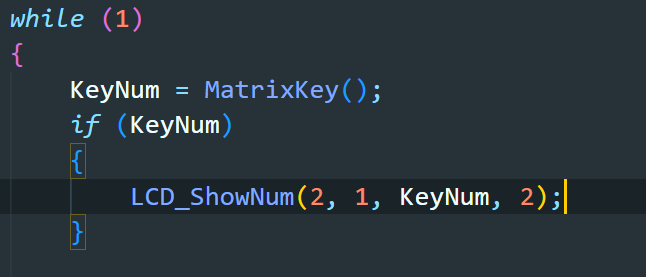

里面的循环是先获得键盘的键值，然后判断这个键值是否等于0，如果不等于0的话，就把它显示在 LCD上面，然后我们可以看一下键值的获取，不等于0，才显示不等于0就等于就意味着按下按键就不等于0了，也就是按下按键才显示对应按键的键值，如果不按一下按键，那么这个键值就一直是0，但是0也不显示，因为只有在按下的时候才会显示在LCD上。

LCD上面会显示不出 wonvz这几个字母，其他的字母都正常显示，最后发现是它下面跳线帽的问题，把跳线帽接到右边两个引脚上，就可以显示了。